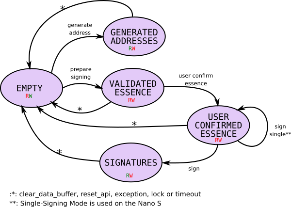

# Shimmer Chrysalis/Stardust App for Ledger Nano S(+)/X Hardware Wallets

## Date Buffer States

The app uses an data buffer of 753 bytes on the Nano S / 8032 bytes on the Nano X for exchanging data with the client. 

Read and write permissions are dependent from the current state the data buffer is in. Reading only is allowed if the buffer contains generated addresses or signatures. Writing only is allowed after it was cleared.

Following image illustrates all states of the data buffer. The nodes represent the state, the edges the API commands that are executed to transition from one state to another.

## API Commands

The protocol used for communicating with Ledger wallets is based on the [APDU](https://de.wikipedia.org/wiki/Application_Protocol_Data_Unit) protocol defined in the ISO7816 (Smartcards).

A transfer consists of an Header and a Body.

| Field Name	| Length (bytes)| Description									|
|---------------|---------------|-----------------------------------------------|
| CLA			| 1				| Instruction Class - 0x7b for Shimmer Chrysalis	|
| INS			| 1				| Instruction Code								|
| P1-P2			| 1				| Instruction Parameters						|
| LEN			| 1				| Length of data to be sent						|
| DATA			| LEN			| Data

### API Commands
---
#### 0x00 - No Operation

**Precondition**: \-

**After**: unchanged

**Parameters**: \-

**Request**: \-

**Response**: \-

**Errors**: \-

---
#### 0x10 - Get App Config

Returns information about the App and the Device.

**Precondition**: \-

**After**: unchanged

**Parameters**: \-

**Request**: \-

**Response**:

| Field | Bytes | Description |
|-------------------|---|---|
| `app_version_major` | 1 | Major version number  |  
| `app_version_minor` | 1 | Minor version number  |  
| `app_version_patch` | 1 | Patch level  | 
| `app_flags` | 1 | Flags  | 
| `device` | 1 | 0: Nano S  1: Nano X   2: Nano S Plus |
| `debug`| 1 | 0: Not compiled in debug mode  1: compiled in debug mode|

Flags:
| Bit | Function |
|-----|----------|
| 0 | Ledger locked |
| 1 | Blindsigning enabled (only Stardust) |
| 2 | App (0: Shimmer, 1: Shimmer) |

**Errors**: \-

---
#### 0x11 - Set Account

All private keys are derived from the bip32-path `2c'/107a'/address'/change'/index'`. This command sets the address bip32 index. The MSB must be set to indicate a *hardened* index. When executing `Set Account` the API and data buffer is initialized. The data buffer state is set to `EMPTY`. In the following documentation, `BIP32 index` always means the 5th part of the BIP32 path and `BIP32 change` always the 4th.

**Precondition**: \-

**After**: `EMPTY`

**Parameters**: \-

**Request**:

| Field | Bytes | Description |
|-------------------|---|---|
| `account` | 4 | Hardened BIP32 account index  |  
| `p1` | 1 | App mode |

App-Mode:

| Mode | Coin Type | Function |
|-|-|-|
| 0x02 | 0x107a | Shimmer Claiming (from IOTA addresses) |
| 0x82 |    0x1 | Shimmer Claiming Testnet |
| 0x03 | 0x107b | Shimmer + Stardust |
| 0x83 |    0x1 | Shimmer + Stardust Testnet |

**Response**: \-

**Errors**: 

| Error | Description |
|-------|-------------|
|`SW_ACCOUNT_NOT_VALID`|Account bip32 index is not hardened|
|`SW_COMMAND_INVALID_DATA`|request data unexpected size, invalid BIP32 address index

---
#### 0x80 - Get Data Buffer State

Get current state of the data buffer.

**Precondition**: \-

**After**: unchanged

**Parameters**: \-

**Request**: \-

**Response**:

| Field | Bytes | Description |
|-------------------|---|---|
| `data_length` | 2 | Length of bytes of valid data in the buffer |  
| `data_type` | 1 | 0: `EMPTY`   1: `GENERATED_ADDRESSES`   2: `VALIDATED_ESSENCE`   3: `USER_CONFIRMED_ESSENCE`   4: `SIGNATURES`   5: `LOCKED` |  
| `data_block_size` | 1 | Size of one block in bytes |  
| `data_block_count` | 1 | Total number of usable data blocks |  
  
**Errors**: \-
  
---
#### 0x81 - Write Data Block

Writes a block of data into the data buffer. The (current) only usage is for transfering the Essence to the device before `Prepare Signing` is executed. Writing to the data buffer only is allowed if it's in `EMPTY` state (see [states](#anchor-data-buffer-states) ).

**Precondition**: `EMPTY`

**After**: unchanged

**Parameters**:

| Parameter | Description |
|-------|-------------|
|`p0` | number of block to be written

**Request**: 

| Field | Bytes | Description |
|-------------------|---|---|
| `data` | `data_block_size` | Data to be written to the data buffer |  

**Response**:

**Errors**:

| Error | Description |
|-------|-------------|
|`SW_COMMAND_NOT_ALLOWED`|data buffer state is not `EMPTY`.|
|`SW_INCORRECT_LENGTH`|length is unequal the block size
|`SW_INCORRECT_P1P2`|block number too high

---
#### 0x82 - Read Data Block

Reads a block of data from the data buffer. Reading only is allowed if the data buffer is in `GENERATED_ADDRESSES` or `SIGNATURES` state (see [states](#anchor-data-buffer-states) ).

**Precondition**: `GENERATED_ADDRESSES`, `SIGNATURES`

**After**: unchanged

**Parameters**:

| Parameter | Description |
|-------|-------------|
|`p1` | number of block to be read

**Request**: \-

**Response**: 

| Field | Bytes | Description |
|-------------------|---|---|
| `data` | `data_block_size` | Data read from the data buffer |  

**Errors**:

| Error | Description |
|-------|-------------|
|`SW_COMMAND_NOT_ALLOWED`|data buffer state is not `GENERATED_ADDRESSES` or `SIGNATURES`.|
|`SW_INCORRECT_P1P2`|block number too high

---
#### 0x83 - Clear Data Buffer

Clears the API and data buffer and sets it to `EMPTY`. The set bip32 account index is not reset. If app was compiled in debug mode, also the non-interactive flag is not set to zero.

**Precondition**: \-

**After**: `EMPTY`

**Parameters**: \-

**Request**: \-

**Response**: \-

**Errors**: \-

---
#### 0x90 - Show Flow

Shows a flow on the UI. This instruction is for showing informative screens on the UI or switching back to the main menu. 

**Preconditions**: \-

**After**: unchanged

**Parameters**: 

| Parameter | Description |
|-------|-------------|
|`p1` | 0: `FLOW_MAIN_MENU`   1: `FLOW_GENERATING_ADDRESSES`   2: `FLOW_GENERIC_ERROR`   3: `FLOW_REJECTED`   4: `FLOW_SIGNED_SUCCESSFULLY`   5: `FLOW_SIGNING`

**Request**: \-

**Response**: \-

**Errors**: 

| Error | Description |
|-------|-------------|
|`SW_INCORRECT_P1P2`|selected flow doesn't exist.|

---
#### 0xa0 - Prepare Signing

Prepare signing parses and validates the uploaded essence for a following signing call.

In additionally to the essence also an array of input BIP32 indices (consisting of 32bit BIP32-index and 32bit BIP32-Change per input) is needed. The size of the essence is determined by the data and is calculated during validation. The array of input indices is directly appended after.  

**Preconditions**: `EMPTY`

**After**: `VALIDATED_ESSENCE`

**Parameters**: 

| Parameter | Description |
|-------|-------------|
|`p1` | (set to 1, compatibility)
|`p2` | 0: Essence doesn't have an Remainder 1: Essence has an Remainder

**Request**: 

| Field | Bytes | Description |
|-------------------|---|---|
| `remainder_index` | 2 | Output index in essence of Remainder address |  
| `remainder_bip32_index` | 4 | BIP32 index of remainder address in essence |  
| `remainder_bip32_change` | 4 | BIP32 change of remainder address in essence |  

**Response**: \-

**Errors**: 

| Error | Description |
|-------|-------------|
|`SW_COMMAND_NOT_ALLOWED`|data buffer state is not `EMPTY`.|
|`SW_ACCOUNT_NOT_VALID`|Account bip32 index is not hardened|
|`SW_COMMAND_INVALID_DATA`|invalid BIP32 remainder or essence [validation](https://github.com/luca-moser/protocol-rfcs/blob/signed-tx-payload/text/0000-transaction-payload/0000-transaction-payload.md) fails|
|`SW_INCORRECT_LENGTH`| request data has unexpected size

---
#### 0xa1 - Generate Address

Generates addresses. If `p1` is set, the new address is shown to the user on the UI. In this mode, the data buffer states switches to `GENERATED_ADDRESSES` when the user confirmed the new address and only one single address is allowed to generate (for Remainder addresses). 

The addresses are saved (including the ED25519 address type) in the data buffer one after another.

**Preconditions**: `EMPTY`

**After**: `GENERATED_ADDRESSS`*

**Parameters**: 

| Parameter | Description |
|-------|-------------|
|`p1` | 0: don't show to the user as interactive flow 1: show to the user as interactive flow (for Remainders).

**Request**: 

| Field | Bytes | Description |
|-------------------|---|---|
| `bip32_index` | 4 | BIP32 index of first address |  
| `bip32_change` | 4 | BIP32 change of first address |  
| `count` | 4 | Count of addresses to generate |  

**Response**: \-

**Errors**: 

| Error | Description |
|-------|-------------|
|`SW_ACCOUNT_NOT_VALID`|Account bip32 index is not hardened|
|`SW_COMMAND_NOT_ALLOWED`|data buffer state is not `EMPTY`.|
|`SW_INCORRECT_LENGTH`| request data has unexpected size
|`SW_COMMAND_INVALID_DATA`|too many addresses to generate, `show_on_screen` set but more than one address to generate, invalid BIP32 index or BIP32 index would wrap around during generation|
|`SW_COMMAND_TIMEOUT`| Timeout happened in interactive mode

---
#### 0xa3 - User Confirm Essence

Presents the validated and parsed essence in clear way on the UI and asks the user to accept or deny it.

**Preconditions**: `VALIDATED_ESSENCE`

**After**: `USER_CONFIRMED_ESSENCE`

**Parameters**: \-

**Request**: \-

**Response**: \-

**Errors**: 

| Error | Description |
|-------|-------------|
|`SW_COMMAND_NOT_ALLOWED`|data buffer state is not `VALIDATED_ESSENCE`.|
|`SW_UNKNOWN`|some basic validation checks failed although validated prior by `Prepare Signing`
|`SW_COMMAND_TIMEOUT`| Timeout happened in interactive mode
|`SW_DENIED_BY_USER`| User denied the essence

---
#### 0xa4 - Sign Single

Signs a single input and returns the signature in the APDU buffer. 

**Preconditions**: `USER_CONFIRMED_ESSENCE`

**After**: unchanged

**Parameters**: 

| Parameter | Description |
|-------|-------------|
|`p1` | Index of input to sign

**Request**: \-

**Response**: 

| Field | Bytes | Description |
|-------------------|---|---|
| `data` | sizeof(`SIGNATURE_UNLOCK_BLOCK`) or sizeof(`REFERENCE_UNLOCK_BLOCK`) | Signature |  

**Errors**: 

| Error | Description |
|-------|-------------|
|`SW_COMMAND_NOT_ALLOWED`|data buffer state is not `USER_CONFIRMED_ESSENCE`.|
|`SW_UNKNOWN`|some basic validation checks failed although validated prior by `Prepare Signing`
|`SW_COMMAND_TIMEOUT`| Timeout happened in interactive mode
|`SW_DENIED_BY_USER`| User denied the essence

---
#### 0xff - Reset

Resets API and data buffer completly (also resets account and non-interactive flag)

**Preconditions**: \-

**After**: `EMPTY`

**Parameters**: \-

**Request**: \-

**Response**: \-
 
**Errors**: \-

### Additional API Commands in Debug Mode

---
#### 0x66 - Dump Memory

Dumps a 128 byte memory page. The Nano S has 4kB, the Nano X has 32kB of internal RAM. Only is available in Debug-Mode. 

This command can be useful to verify how much stack in the device is used.

**Preconditions**: \-

**After**: unchanged

**Parameters**: 

| Parameter | Description |
|-------|-------------|
|`p1` | Number of page to dump

**Request**: \-

**Response**: 

| Field | Bytes | Description |
|-------------------|---|---|
| `data` | 128 | One memory page |  

**Errors**: \-

---
#### 0x67 - Set Non-Interactive Mode

For automatic testing, the `non-interactive` flag can be set. Generating a new remainder address and confirming an essence is accepted automatically.

This command only is available in debug mode.

**Preconditions**: \-

**After**: unchanged

**Parameters**: 

| Parameter | Description |
|-------|-------------|
|`p1` | 0: Non-Interactive Mode disabled  1: Non-Interactive Mode enabled

**Request**: \-

**Response**: \-

**Errors**: \-
